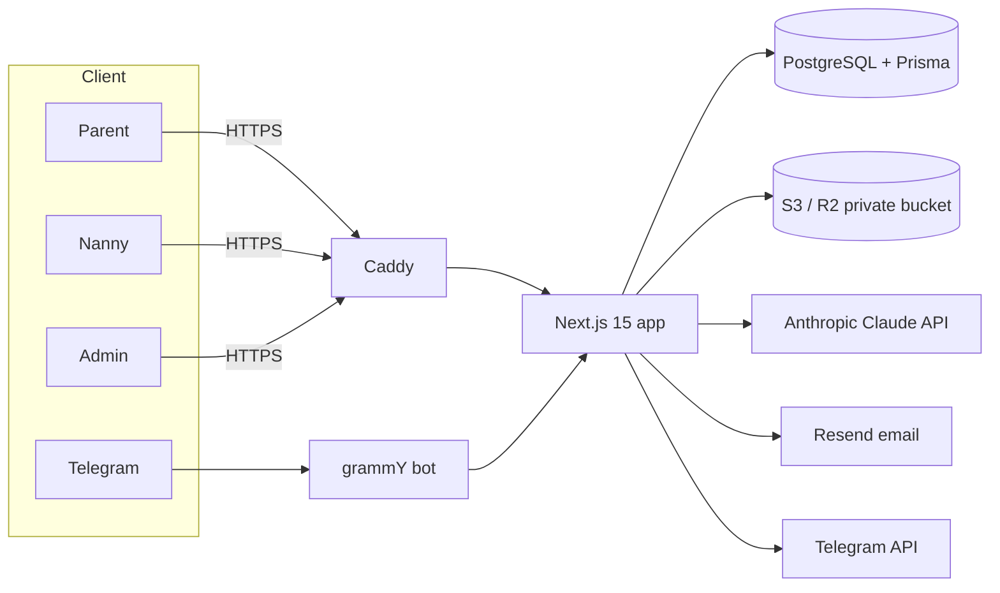

# Dayak — verified nannies in Yerevan

Dayak connects parents in Yerevan with **verified** nannies. "Verified" means a nanny
completed a structured **AI interview**, uploaded identity + reference documents, and a
human admin reviewed everything and clicked **Verify**. Parents search verified nannies
on a map by district, schedule, language and child age, save favourites, and request an
introduction; a 5,000 ֏ matching fee (manual via Idram in v1) unlocks contact details.
Full trilingual parity: **Armenian, Russian, English**.

## Architecture



**Monorepo** (pnpm workspaces):

| Path | What |
|---|---|
| `apps/web` | Next.js 15 app — UI, API routes, server actions (auth, search, interview, admin) |
| `apps/bot` | grammY Telegram bot (3-language parent/nanny flows, magic links) |
| `packages/db` | Prisma schema + client, policy/serializers, status machine, seed |
| `packages/ai` | interview engine (Anthropic streaming + offline mock), prompts, finish tool |
| `packages/notifications` | table-driven email + Telegram templates and dispatch |
| `packages/i18n` | `hy`/`ru`/`en` messages + key-parity check |
| `packages/config` | shared tsconfig / eslint / tailwind presets |

Stack: Next.js 15 (App Router, TS strict) · PostgreSQL 16 + Prisma · Auth.js v5
(credentials + Google + magic-link) · S3/MinIO private buckets with 60 s presigned URLs ·
Anthropic Claude API · MapLibre GL + OpenStreetMap · next-intl · Tailwind + shadcn/ui ·
Resend · grammY · Docker + Caddy.

## Quick start

```bash
corepack enable
pnpm install
pnpm db:up                                   # postgres + redis + minio (Docker)
cp .env.example .env && cp .env.example apps/web/.env.local
#   set AUTH_SECRET in both (openssl rand -base64 32)
pnpm db:push && pnpm db:seed
pnpm dev                                      # http://localhost:3000  (use 3100 if 3000 is taken)
```

Seeded logins: admin `admin@dayak.local / admin1234`, nanny `nanny1@dayak.local /
nanny1234`, parent `parent1@dayak.local / parent1234`.

## Quality gates

```bash
pnpm lint && pnpm typecheck && pnpm test && pnpm i18n:check
pnpm build
pnpm --filter @dayak/web test:e2e            # Playwright (needs app + db running)
```

Deployment, backups, secret rotation, and the security scan are in
[`docs/RUNBOOK.md`](docs/RUNBOOK.md); design decisions in
[`docs/DECISIONS.md`](docs/DECISIONS.md); the full spec in
[`docs/dayak-web-spec.md`](docs/dayak-web-spec.md).

## Security highlights

- ID images live only in a private bucket; admin access via 60 s presigned URLs, every
  view audited.
- `aiScore`/`aiFlags`/`aiSummary` are admin-only and never serialised to other roles.
- Nanny phone/surname revealed to a parent only after `FEE_PAID` — enforced at the data
  layer (the field is absent from the API payload otherwise).
- Public map coordinates jittered ±300 m at verification.
- argon2id passwords; rate limits on auth/interview/presign; CSP + security headers; CSRF
  on server actions.
